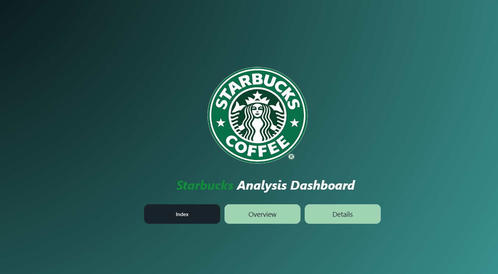
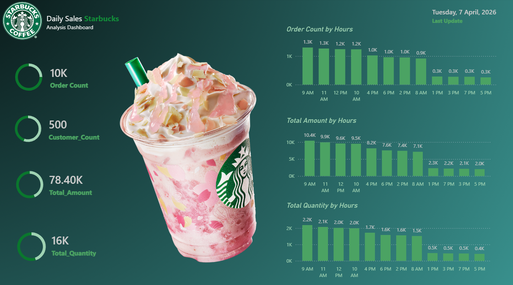
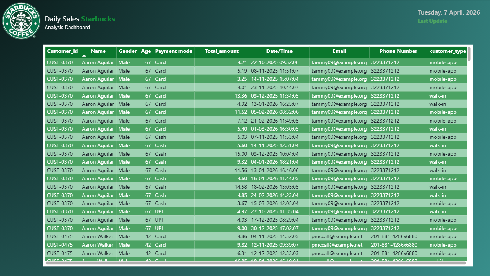

# ☕ Starbucks Sales Analysis Dashboard

An interactive **Power BI dashboard** built to analyze sales performance, customer behavior, and time-based ordering patterns.

---

## 📊 Overview

This project explores Starbucks sales data to uncover **when customers buy, how revenue flows throughout the day, and what drives order volume**.
The dashboard is designed with a focus on **clarity, interactivity, and business-relevant insights**.

---

## 🎯 Objectives

* Identify peak hours of customer activity
* Analyze hourly revenue and order trends
* Track key performance indicators (Orders, Customers, Revenue, Quantity)
* Provide detailed transaction-level visibility

---

## 🛠️ Tech Stack

* **Power BI** (Dashboard & Visualization)
* **DAX** (Measures & Calculations)
* **Data Modeling**
* **Data Cleaning & Transformation**

---

## 📈 Key Insights

* 🕘 **Morning to midday drives maximum sales volume**
* 📉 Noticeable drop in activity during late hours
* 📊 Revenue closely follows order count patterns
* 🔗 Strong correlation between quantity sold and total revenue

---

## 🧭 Dashboard Structure

The dashboard is divided into three intuitive sections:

* **Index** → Entry navigation page
* **Overview** → KPI metrics & hourly analysis
* **Details** → Transaction-level data exploration

---

## 🖼️ Preview

### Index



### Overview



### Details



---

## 📁 Project Structure

```bash
starbucks-sales-analysis-powerbi/
├── data/
├── dashboard/
├── images/
└── README.md
```

---

## ▶️ How to Use

1. Open the `.pbix` file in Power BI Desktop
2. Navigate using built-in page buttons
3. Interact with visuals to explore trends

---

## 🚀 Scope for Enhancement

* Add store/location-level analysis
* Introduce advanced KPIs (growth rate, segmentation)
* Deploy to Power BI Service for live access

---

## 👨‍💻 About

Built as part of a hands-on data analytics journey focused on transforming raw data into actionable insights.
